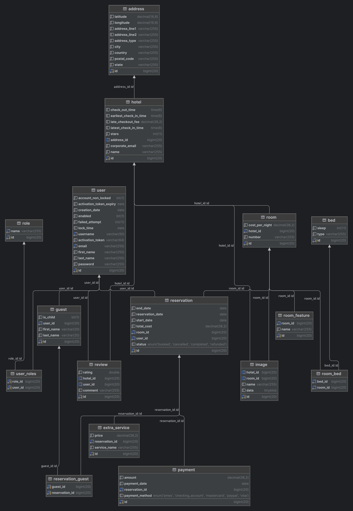

## QuickStay: A Hotel Booking Platform

**QuickStay** is a dynamic web application designed for seamless hotel room booking. This application empowers users to effortlessly browse available rooms, view detailed information about accommodations, and securely manage their reservations.

**Functionality:**

* **User Authentication & Authorization:**
    * Secure user registration and login.
    * Role-based access control (e.g., User, Admin).
* **Hotel & Room Browsing:**
    * Search for available rooms by location, date range, and guest capacity.
    * View comprehensive details of each room, including amenities and photos.
* **Reservation Management:**
    * Make, view, and cancel reservations.
    * Manage guest information.
    * Secure payment processing.

**Technologies Used:**

* **Backend:**
    * **Spring Boot:** Framework for building robust and scalable backend systems.
    * **Spring Security:**  For implementing authentication, authorization, and other security features.
    * **Spring Data JPA:** For interacting with the database using Java Persistence API.
    * **(Database):** Choose a suitable database (e.g., MySQL, PostgreSQL, H2).
* **Frontend:**
    * **Thymeleaf:** Server-side template engine for creating dynamic web pages.
    * **HTML, CSS, JavaScript:** Core web technologies for building the user interface.
* **Build Tools:**
    * **Maven** or **Gradle:** For dependency management and building the application.

**External Libraries & APIs (Optional):**

* **OpenStreetMap API (or similar):**  To integrate maps and location-based features (e.g., display hotels on a map, allow users to search for hotels near a specific address).

## Database Schema Diagram

